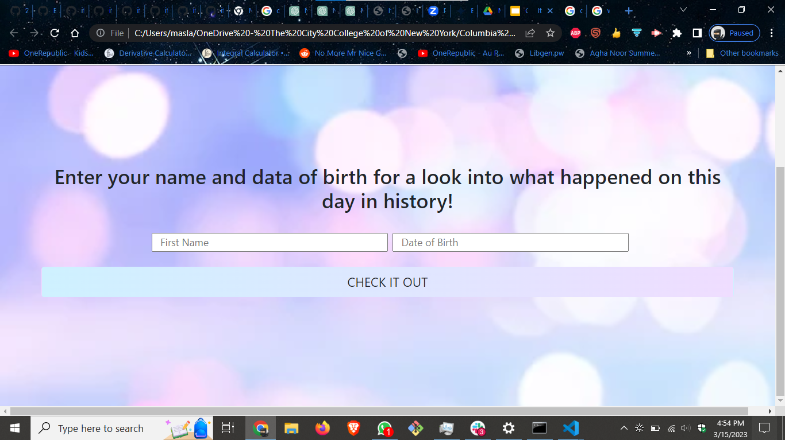

# USER STORY

GIVEN that today is my birthday, and perhaps a ho-hum one, I am looking to liven up my big day.  WHEN I search my birthday, THEN I discover a wealth of interesting stories to entertain myself and my friends.

# Description
GIVEN today is my birthday
WHEN I input my name and birthday
THEN it saves name to local storage
THEN I am presented with NY Times top three stories from that day
with the article name and abstract
WHEN I scroll down
THEN I am presented with people born on the same day and month as me and a summary of them
WHEN I scroll down
THEN I am presented with wikipedia stories for that day with images
WHEN I scroll down
THEN I am presented with top songs from my birthday along with song image
WHEN I click the button below that on the bottom of the page
THEN I am taken to another page thats says Happy Birthday with name pulled from local storage and showers with confetti
WHEN I refresh the page
THEN then I am taken back to first page

## Mock-Up
The following animation demonstrates the application functionality:

<!-- @TODO: create ticket to review/update image) -->

## Github Pages Link

https://zeedabbagh.github.io/its-your-party/
